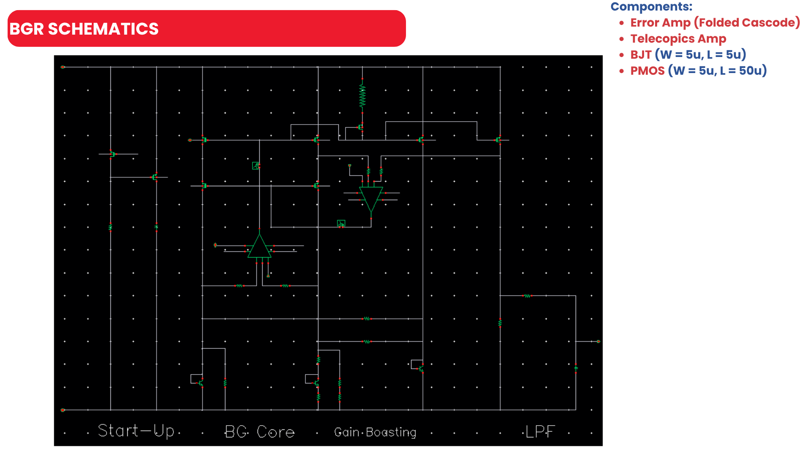
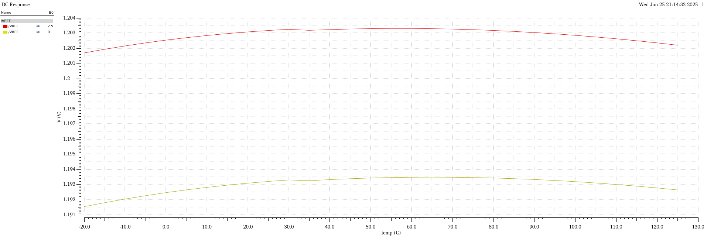

# HIGH PSRR BANDGAP REFERENCE (BGR) DESIGN

**Authors:** Trong Hieu Tran (Hira) 

**Organization:** Viettel High Tech Company

**Technology/Process:** TSMC 65nm

**Project Duration:** May, 2025 to June, 2025

**Date (lastest upadated):** 26th June 2025  

## Abstract
This project details the design, implementation, and verification of a high-performance CMOS Bandgap Reference (BGR) circuit targeting a stable 1.2V output. The architecture incorporates advanced techniques to achieve stringent performance goals, including higher-order temperature curvature correction to achieve a low temperature coefficient...

## 1. Introduction
A bandgap reference (BGR) is a fundamental building block in analog and mixed-signal in-
tegrated circuits. Its primary function is to provide a stable reference voltage that is highly
insensitive to changes in power supply voltage and operating temperature. This stability is
crucial for the predictable operation of other analog circuits such as ADCs, DACs, LDOs, and
PLLs.
The core principle of a BGR involves generating two voltages with opposing temperature
coefficients and summing them with appropriate weighting. A voltage proportional to the base-
emitter voltage (VBE) of a bipolar junction transistor (BJT) exhibits a negative, or Comple-
mentary to Absolute Temperature (CTAT), coefficient. A second voltage, derived from the
difference in VBE between two BJTs operating at different current densities (∆VBE ), exhibits
a positive, or Proportional to Absolute Temperature (PTAT), coefficient. By summing them, a
zero-temperature-coefficient (ZTC) voltage can be achieved at a specific temperature.
This project, undertaken by the Semiconductor Technology Department at Viettel, focuses
on the complete design and verification flow of a BGR circuit aimed at high-performance appli-
cations, demanding excellent PSRR and temperature stability.

## 2. Design Specifications

The target performance metrics for the Bandgap Reference are outlined in Table 1. The design
was required to operate reliably across the Process, Voltage, and Temperature (PVT) corners
detailed in Table 2.

### Specification
| Parameter   | Min    | Typ   | Max    | Unit   | Notes                                                                               |
|:------------|:-------|:------|:-------|:-------|:------------------------------------------------------------------------------------|
| VDD         | 2.25   | 2.5   | 2.75   | V      |                                                                                     |
| Temp        | -20    | 25    | 125    | C      |                                                                                     |
| VBG         | 1.188  | 1.2   | 1.212  | V      | Post-trim, 6-sigma                                                                  |
| Temp Co.    |        |       | 20     | ppm    |                                                                                     |
| Iq          |        | 100u  | 150u   | A      |                                                                                     |
| PSR (DC)    |        |       | -70    | dB     |                                                                                     |
| PSR (10k)   |        |       | -60    | dB     |                                                                                     |
| Function    |        |       |        |        | Startup, Curvature compensation, Trimming for process variation, Powerdown switches |

**Table 1: Design Specifications for the Bandgap Reference.**

### Corner Setting
|               | P             | V              | T         |
|---------------|---------------|----------------|-----------|
| **MOS**       | SS SF FS FF   |                |           |
| **BJT**       | SS FF         | 2.5V +/-10%    | -20 125   |
| **RES**       | SS FF         | 2.5V +/-10%    | -20 125   |
| **CAP**       | SS FF         |                |           |
| **MONTE CARLO** | Process + Mismatch |         |           |

**Table 2: Corner Setting across Process, Voltage, and Temperature (PVT).**

## 3. Circuit Architecture and Implementation

To meet the stringent specifications, a robust architecture was selected, incorporating several
advanced techniques for performance enhancement. The overall block diagram of the proposed
BGR is shown in Figure 1.

**Figure 1(a): Overall BGR Block Diagram showing key functional blocks.**

The architecture is based on a current-mode topology where an error amplifier ensures that
the PTAT current generated by the core is accurately mirrored to the output branch. Key
components and techniques are detailed below.

**Figure 1(b): Overall BGR Block Diagram showing key functional blocks.**

### 3.1. Error Amplifier

A high-gain error amplifier is essential to enforce the virtual short between its inputs, which ensures that the voltage across the PTAT resistor is precisely $\Delta V_{BE}$. For this design, a PMOS-input folded-cascode amplifier was chosen (Figure 2).

**Figure 2: Error Amp schematic: PMOS-input Folded Cascode Amplifier.**

The PMOS input stage allows for a low common-mode input voltage, which is suitable for
the VBE-based voltages at the amplifier’s input nodes. The folded-cascode topology provides
high gain and good PSRR in a single stage, as summarized in the comparison table (Figure 3).

**Figure 3: Comparison of different amplifier topologies.**

### 3.2. Curvature Correction

The fundamental principle of a bandgap reference is to create a zero temperature coefficient
(ZTC) voltage by summing two components with opposing temperature dependencies: a Comple-
mentary to Absolute Temperature (CTAT) voltage and a Proportional to Absolute Temperature
(PTAT) voltage.

### 3.2.1. First-Order Temperature Compensation
### First-Order Temperature Compensation

The CTAT component is the base-emitter voltage, $V_{BE}$, of a bipolar transistor, which decreases linearly with temperature. The PTAT component is derived from the difference in the base-emitter voltages of two transistors operating at different current densities, $\Delta V_{BE}$:

$$
V_{CTAT}(T) = V_{BE}(T)
$$

$$
V_{PTAT}(T) = \Delta V_{BE} = V_T \ln(n) = \frac{kT}{q} \ln(n)
$$

where $V_T$ is the thermal voltage, $k$ is Boltzmann's constant, $q$ is the elementary charge, and $n$ is the ratio of emitter areas.

The reference voltage is a weighted sum of these two components. In a current-mode BGR, this is achieved by summing a CTAT current and a PTAT current and passing the total current through an output resistor $R_{out}$:

$$
V_{ref} = R_{out} \left( \frac{V_{BE}}{R_1} + \frac{\Delta V_{BE}}{R_1} \right) = \frac{R_{out}}{R_1} \left( V_{BE} + V_T \ln(n) \right)
$$

By choosing the resistor ratio $\frac{R_{out}}{R_1}$ appropriately, the negative temperature coefficient of $V_{BE}$ can be cancelled by the positive coefficient of $V_T \ln(n)$, achieving a first-order ZTC reference.
### 3.2.2. The Origin of Curvature

The assumption of a purely linear temperature dependence for $V_{BE}$ is an oversimplification. A more accurate model for $V_{BE}(T)$ reveals a non-linear term:

$$
V_{BE}(T) = V_{G}(0) - \left( \frac{T}{T_0} \right) [V_{G}(0) - V_{BE}(T_0)] + (\eta - m)V_T \ln\left(\frac{T}{T_0}\right)
$$

where $V_{G}(0)$ is the bandgap voltage of silicon extrapolated to 0 K, $T_0$ is a reference temperature, and $(\eta - m)$ is a process-dependent constant (typically around 2).

**Figure 4: Calculation of VBE**

$$
V_{BE} = 671.2\,\text{mV}; \quad \Delta V_{BE} = 54.3\,\text{mV}; \quad K \cdot \Delta V_{BE} + V_{BE} = 1.2\,\text{V}; \quad K \approx 10.6
$$

The first two terms describe the dominant linear negative slope.  

The final term, $(\eta - m)V_T \ln\left(\frac{T}{T_0}\right)$, is a higher-order non-linear term proportional to $T \ln(T)$. When the linear components are cancelled in the BGR, this non-linear term remains, resulting in a parabolic "curvature" in the $V_{ref}$ vs. temperature plot. This residual curvature limits the temperature stability over a wide range.

### 3.2.3. Implementing the Correction

To achieve a lower temperature coefficient, this curvature must be compensated. This is done by introducing a non-linear correction current, $I_{(ct)}$, which generates a voltage term that counteracts the $T \ln(T)$ behavior.

**Figure 5: Curvature correction principle.**

As shown in Figure 5, this is achieved by designing I(ct) to have a specific non-linear tem-
perature dependence. This current is generated using the existing PTAT voltage or current in
the circuit and feeding it through non-linear elements (e.g., MOS transistors). This correction
current is then passed through a resistor (R5 in the diagram) to generate a correction voltage:

$$
V_{corr}(T) = I_{ct}(T) \cdot R_5
$$

The goal is to shape $V_{corr}(T)$ to be equal and opposite to the unwanted non-linear term from $V_{BE}(T)$:

$$
V_{corr}(T) \approx - (\eta - m)V_T \ln\left(\frac{T}{T_0}\right)
$$

By adding this correction term into the main summation, the final reference voltage becomes:

$$
V_{ref,\text{corrected}} = \frac{R_{out}}{R_1} \left( V_{BE} + \Delta V_{BE} - V_{corr} \right)
$$

This cancellation of the higher-order term results in a significantly flatter temperature response for $V_{ref}$ across the entire operating range, as demonstrated by the simulation results.

## 3.3. High PSRR Techniques

Power Supply Rejection Ratio (PSRR) is a critical metric measuring the circuit's ability to reject noise from the power supply ($V_{dd}$). The PSRR can be generally defined by the change in the output current ($\Delta I_{out}$) relative to the supply variation, where $V_{ref} = I_{out} \cdot R_{L}$. A primary goal is to minimize the sensitivity of the internal currents to $v_{dd}$. Relying on the analysis in [Kamel et al., 2016] and [Razavi, 2021], our design employs a multi-faceted strategy combining output impedance boosting and feedforward cancellation to achieve a high, wideband PSRR. Two primary techniques were employed to achieve the target PSRR of >70 dB.

### 3.3.1. Gain Boosting for High Output Impedance

In modern CMOS processes, short-channel effects lead to a low intrinsic output resistance ($r_{ds}$) in transistors. This provides a direct path for supply noise to modulate the drain current of the BGR's core current mirrors, degrading PSRR. The fundamental relationship, as derived by Razavi, shows that PSRR is inversely proportional to the gain of the error amplifier ($A_1$) and the ratio of the output load resistance ($R_L$) to the internal PTAT resistor ($R_1$):

$$
\text{PSRR} \approx \frac{A_1 R_1}{R_L}
$$

While increasing $A_1$ is effective, improving the output impedance of the current mirror itself provides a more direct solution. To this end, a regulated cascode, or gain-boosting, technique is employed. A secondary feedback amplifier ($A_2$) regulates the drain of the cascode device, stabilizing its drain-source voltage.

This dramatically increases the effective output impedance of the current mirror. As modeled by Kamel et al., the boosted output resistance ($R_{out}$) is:

$$
R_{out} = (r_{ds} \parallel R_{L}) \cdot (1 + A_{v,A2})
$$

where $A_{v,A2}$ is the voltage gain of the secondary boosting amplifier. This boosted impedance directly improves the PSRR. The transfer function from supply noise ($v_{dd}$) to the reference voltage ($v_{ref}$) is given by:

$$
\frac{v_{ref}}{v_{dd}} = \frac{1 - PSRR_{A1}}{g_m \cdot R_{out}} = \frac{1 - PSRR_{A1}}{g_m \cdot (r_{ds} \parallel R_{L}) \cdot (1 + A_{v,A2})}
$$

This equation clearly shows that the supply rejection is enhanced by the gain of the boosting amplifier, $A_{v,A2}$. This technique is most effective at low-to-mid frequencies where the amplifier has sufficient gain.

**Figure 6: Gain-Boosting Telescopic Amplifier schematic.**

### 3.3.2. Feedforward Noise Cancellation

While gain-boosting is highly effective at low frequencies, its benefit diminishes as the gain of the boosting amplifier rolls off. To improve PSRR at higher frequencies, a feedforward noise cancellation path was implemented — a technique explored in [1].

As shown in Figure 7, transistor **Ms** acts as a dedicated feedforward path. Its purpose is to sense the AC noise on the supply rail (at the source of **Mp1**) and couple it directly to the gate of the same transistor.  
The key principle is to keep the gate-source voltage ($V_{GS}$) of the current source transistor **Mp1** constant in the presence of supply noise.

By carefully sizing **Ms**, the noise signal fed forward to the gate can be made to have the same amplitude and phase as the noise appearing at the source. This creates a cancellation effect, preventing the supply noise from modulating the output current.

This passive cancellation path is very effective at high frequencies where the main feedback loop has insufficient gain to reject the noise, thus ensuring a wideband PSRR performance.

**Figure 7: Feedforward noise cancellation topology.**

### 3.4. Start-Up Circuit

Bandgap circuits can have multiple stable operating points, including an undesirable state where
all currents are zero. A dedicated start-up circuit (Figure 8) is necessary to ensure the BGR
always powers up into its correct operating state.

- **At power-on (BGR OFF):**  
  The `PREVREF` node is high, keeping `M40` off. The `START_UP` node is pulled low through resistor `R8`. This low signal provides a "kick-start" current to the BGR core, forcing it out of the zero-current state.

- **Normal operation (BGR ON):**  
  Once the BGR is operational, `PREVREF` goes low, turning `M40` on. `M40` then pulls the `START_UP` node high, which deactivates the start-up injection path. The circuit then sits idle, consuming negligible power.

**Figure 8: Start-up circuit schematic.**

**Figure 9: The DC response according to the VDD variation**

### 3.5. Output Low-Pass Filter (LPF)

A simple first-order RC filter is placed at the output. This filter attenuates high-frequency noise from the BGR core and external sources, providing a cleaner DC reference voltage to subsequent circuits.  

The cutoff frequency ($f_c$) is determined by the formula:

$$
f_c = \dfrac{1}{2\pi RC}
$$

Thus, all noise components above $f_c$ are significantly attenuated.

**Figure 10: The Lowpass Filter implementation.**

### 3.6. Power-Down Switch
To support power-saving modes and minimize standby leakage current, a power-down switch
mechanism is integrated into the design. This feature, often referred to as power gating, allows
the entire BGR core to be effectively disconnected from the power rails when it is not needed.
The implementation uses a combination of PMOS header switches and NMOS footer switches
to achieve complete isolation, as shown in Figure 11.

**Figure 11: The Power-down Switch implementation.**

- **Function:**  
  These PMOS transistors act as header switches, positioned between the main VDD supply and the BGR's internal PMOS current sources. Their role is to control the connection to the positive supply rail.

- **Control:**  
  The switches are driven by the active-low signal `PWD_B`.
  
  - When `PWD_B` is logic '0' (Low), the switches are **ON**, and the BGR core is powered and operates normally.
  - When `PWD_B` is logic '1' (High), the switches are **OFF**, cutting the positive supply path and de-powering the circuit.

**Figure 12: The transient of Vref corresponding to the Power-Down Switch turns on**

**Figure 13: The transient of Vref corresponding to the Power-Down Switch turns off**

The transient simulation results in Figures 12 and 13 validate this functionality.  

The top plot shows that when `PWD_B` transitions from high to low (turning the BGR on), the reference voltage `/VREF` successfully ramps up to its stable 1.2V level.  

Conversely, the bottom plot shows that when `PWD_B` transitions from low to high (turning the BGR off), `/VREF` decays to zero, and the overall current consumption drops — confirming a successful power-down sequence.

## 3.7. Trimming Network Design

To ensure the BGR meets the tight $\pm1\%$ accuracy specification across process variations, a trimming network is essential. The design of this network is based on the 3-sigma variation observed in Monte Carlo simulations, which provides the target range for correction.

The trimming scheme is designed as follows:

1. **Determine Required Trimming Range:**  
   The Monte Carlo analysis shows a typical post-layout 3-sigma variation of $\pm 14.196\,\text{mV}$ around a nominal Vref of $1.2046\,V$.  
   To cover this entire range, the total trimming capability must be at least: $2 \times 14.196mV = 28.392mV$

2. **Define Trimming Resolution and Bits:**  
   A 1-bit digital trimming scheme was selected for simplicity, providing $2^1 = 2$ discrete trimming steps.  
   This allows for a single adjustment to bring the output voltage closer to the target.  
   The required voltage resolution for a single trimming step is:

   $$1LSB_{trim} = \frac{Total\ Variation\ Range}{Number\ of\ Trim\ Steps} = \frac{28.392mV}{2} \approx 14.2mV$$

4. **Calculate Resistor Values:**  
   The trimming is implemented by adjusting the output resistor network.  
   Based on the nominal reference current $I_{\text{ref}} = 11.99\,\mu\text{A}$, the required resistance values are:

   - Minimum resistance of the main output resistor:

  $$
R_{min} = \frac{V_{ref,nom} - \Delta V_{3-sigma}}{I_{ref}} = \frac{1.2046\,V - 14.196\,mV}{11.99\,\mu A} = \frac{1.1904\,V}{11.99\,\mu A} \approx 99.28\,k\Omega
  $$

- Resistance for a single trimming step:

  $$R_{trim} = \frac{1\,LSB_{trim}}{I_{ref}} = \frac{14.2\,mV}{11.99\,\mu A} \approx 1.18\,k\Omega$$

The final implementation consists of a main resistor close to $R_{\text{min}}$ in series with a single, switchable resistor of value $R_{\text{trim}}$.  
This network ensures that the output voltage can be precisely calibrated to the target 1.2V after manufacturing, guaranteeing a high-yield product.

---

## 4. DC, AC and STB Simulation and Verification Results

The design was extensively simulated using Cadence Spectre across all specified PVT corners and with Monte Carlo analysis to validate its performance.  
Detailed checks were performed to ensure all transistors in the error amplifier and gain-boosting amplifier remained in the saturation region across all conditions.

### 4.1. DC Analysis (Temperature Sweep)

The variation of the output reference voltage ($V_{ref}$) with temperature was simulated from -20°C to 125°C.  
The result demonstrates a well-controlled, "bow-tie" shaped curve, indicating effective curvature correction.  
Across all PVT corners, the total voltage variation ($\Delta V_{ref}$) was kept to a minimum.  

The resulting temperature coefficient was calculated to be approximately:

**12.9 ppm/°C** in the worst case, which is well below the **20 ppm/°C** specification.

**Figure 14: Vref variation with temperature across corners.**

**Figure 15: Tabulated DC simulation results across PVT corners.**

### 4.2. PSRR and Stability Analysis

The Power Supply Rejection Ratio (PSRR) and loop stability were analyzed through AC and stability simulations. The results, shown in Figure `psrr_stb_graph`, confirm a robust and high-performance design.

- **PSRR (DC):**  
  Greater than **75.79 dB** across all corners, exceeding the 70 dB specification.

- **PSRR (@ 10 kHz):**  
  Greater than **132.4 dB** across all corners.  
  This excellent high-frequency performance is a direct result of the gain-boosting and feedforward cancellation techniques.

- **Stability:**  
  The phase margin was verified to be greater than **51.82°** across all corners, ensuring the stability of the feedback loop with sufficient margin.

**Figure 16: PSRR and Loop Gain vs. Frequency**

**Figure 17: Tabulated PSRR and stability results across PVT corners.**

## 4.3.Monte Carlo Analysis

### Monte Carlo Analysis

To evaluate the design's robustness against random process and mismatch variations, Monte Carlo simulations were performed for 108 runs.  
The analysis confirms the stability of the design and identifies the primary sources of variation, which is crucial for guiding layout and ensuring high manufacturing yield.

The simulation results, shown in Figure 18, indicate a **100% yield** (108 out of 108 passed), with all runs falling within the correctable range of the digital trimming network.  

As seen in the summary (Figure 18b), the pre-trim 3-sigma output variation was found to be:

$$
\pm 14.193\,\text{mV}
$$

around a mean of 1.2042 V, which aligns with the design goals for the trimming circuit.

A key part of the analysis was identifying the primary sources of variation using Cadence's sensitivity tool (Figure 18a).  
The results reveal that the variation in the output reference voltage ($V_{\text{ref}}$) is dominated by two main sources:

- **Resistor Mismatch (`random1_{res}`):**  
  Contributing approximately **54%** of the total variation.  
  This is expected, as the accuracy of the PTAT and CTAT current generation is directly dependent on the matching of the core resistor network.

- **BJT Mismatch (`random1_{bg}_{dio}`):**  
  Contributing the remaining **46%** of the variation.  
  This highlights the sensitivity of the $V_{BE}$ and $\Delta V_{BE}$ terms to the physical properties and matching of the core bipolar transistors.

Contributions from other devices were found to be negligible.  
These findings underscore the critical importance of a careful, common-centroid layout for both the core resistor network and the bipolar transistors to minimize these dominant mismatch effects.

**Figure 18(a) Sensitivity analysis identifying dominant contributors.**

**Figure 18: Monte Carlo analysis results over 108 runs: (a) Sensitivity breakdown showing resistor
and BJT mismatch as the dominant factors, and (b) Monte Carlo Summary**

**Figure 18(b) Monte Carlo Result.**

**Figure 19: the 3-sigma output voltage variation**

## 4.4. Post-Trimming Result

**Figure 20: Graph of Nominal Corner simulation comparing Pre and Post-Trim**

**Figure 21: 1-bit trim simulation result**

## 5. Summary of Results

The overall performance of the Bandgap Reference design was verified against all key specifications across the defined worst-case Process, Voltage, and Temperature (PVT) corners. The table below provides a concise summary of the results. The design successfully meets or exceeds all target metrics, demonstrating its robustness and suitability for integration.  

Notably, the PSRR performance at 10 kHz significantly surpasses the specification, highlighting the effectiveness of the gain-boosting and feedforward cancellation techniques.

| **Parameter**                | **Specification** | **Simulated Result** | **Units**     | **Status / Margin**         |
|-----------------------------|-------------------|----------------------|---------------|------------------------------|
| Output Voltage ($V_{ref}$)  | 1.2 ± 1%          | 1.191 -- 1.209       | V             | ✅ **Pass**                  |
| Temp. Coefficient (TC)      | < 20              | 12.9                 | ppm/°C        | ✅ **Pass**                  |
| Current Consumption         | < 15              | 12.5                 | μA            | ✅ **Pass**                  |
| PSRR (DC)                   | > 70              | > 75.79              | dB            | ✅ **Pass**                  |
| PSRR (@ 10 kHz)             | > 60              | > 132.4              | dB            | 🚀 **Exceeds (+72 dB)**     |
| Phase Margin                | > 45              | > 51.82              | °             | ✅ **Pass**                  |
| Yield (Post-Trim)           | > 99.7%           | 100% (108 runs)      | —             | ✅ **Pass**                  |

---

## 6. Conclusion

The Bandgap Reference circuit has been successfully designed and verified through comprehensive simulations. The chosen architecture, incorporating curvature correction and advanced PSRR enhancement techniques like gain-boosting and feedforward cancellation, has proven to be robust and high-performing.  

All key specifications for temperature stability, power supply rejection, and statistical variation have been met with sufficient margin.  
This project demonstrates a complete and successful design cycle, delivering a production-ready IP block suitable for demanding analog and mixed-signal applications.

---

## References

1. Kamel, A. I., Saad, A., & Siong, L. S. (2016).  
   *A high wide band PSRR and fast start-up current mode bandgap reference in 130nm CMOS technology.*  
   _2016 IEEE International Symposium on Circuits and Systems (ISCAS)_, Montreal, QC, Canada, pp. 506–509.  
   [https://doi.org/10.1109/ISCAS.2016.7527288](https://doi.org/10.1109/ISCAS.2016.7527288)

2. Chen, Z., Wang, Q., Li, X., Song, S., Chen, H., & Song, Z. (2023).  
   *A High-Precision Current-Mode Bandgap Reference with Nonlinear Temperature Compensation.*  
   _Micromachines, 14_(7), 1420.  
   [https://doi.org/10.3390/mi14071420](https://doi.org/10.3390/mi14071420)

3. Razavi, B. (2021).  
   *A circuit for all seasons.*  
   IEEE Solid-State Circuits Magazine, 13_(3), 6–7, 107.  
   [https://doi.org/10.1109/MSSC.2021.3085202](https://doi.org/10.1109/MSSC.2021.3085202)

4. Razavi, B. (2017).  
   _Design of Analog CMOS Integrated Circuits_ (2nd ed.). McGraw-Hill Education.

 5. D. Holberg and P. Allen, B. (2011).  
 CMOS Analog Circuit Design. Oxford University Press, USA.

6. R. Jacob Baker, B. (2019).  
 CMOS Circuit Design, Layout, and Simulation. IEEE Press.
